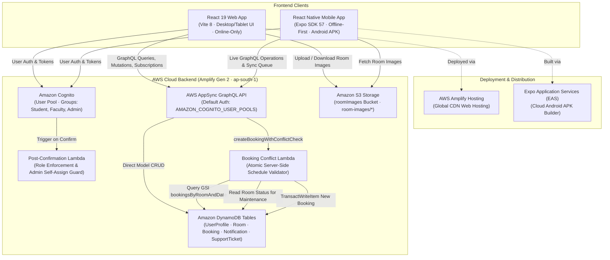

# CampusRoom — Campus Room Booking System

[](https://aws.amazon.com/amplify/)
[](https://aws.amazon.com/appsync/)
[](https://aws.amazon.com/cognito/)
[](https://aws.amazon.com/dynamodb/)
[](https://react.dev/)
[](https://vitejs.dev/)
[](https://expo.dev/)
[](https://expo.dev/eas)

**CampusRoom** is a full-stack, enterprise-grade campus space reservation and facility management platform developed for universities and educational institutions. It provides real-time room discovery, server-side conflict detection, administrative workflow automation, facility issue tracking, and an **offline-first mobile experience** for students and faculty on the go.

- **Repository**: [`rampranai-0104/campus-service-aws`](https://github.com/rampranai-0104/campus-service-aws)
- **Team**: `Y24-SAA-Team338`
- **Primary Use Case**: Campus auditorium, seminar hall, computing lab, and study pod allocation.

---

## Table of Contents

1. [Project Overview](#project-overview)
2. [Project Status](#project-status)
3. [Key Concepts for Beginners](#key-concepts-for-beginners)
4. [System Architecture](#system-architecture)
5. [Database Architecture & Data Models](#database-architecture--data-models)
6. [Booking Lifecycle & Conflict Engine](#booking-lifecycle--conflict-engine)
7. [Room Maintenance Workflow](#room-maintenance-workflow)
8. [Support Ticket System](#support-ticket-system)
9. [Authentication, Authorization & Security](#authentication-authorization--security)
10. [Web Application (Online-Only)](#web-application-online-only)
11. [Mobile Application & Offline-First Engine](#mobile-application--offline-first-engine)
12. [AppSync GraphQL API Reference](#appsync-graphql-api-reference)
13. [Project Directory Structure](#project-directory-structure)
14. [Local Development Setup](#local-development-setup)
15. [Deployment Guide](#deployment-guide)
16. [Testing & Quality Assurance](#testing--quality-assurance)
17. [Troubleshooting Guide](#troubleshooting-guide)
18. [Evaluator Demonstration Script](#evaluator-demonstration-script)
19. [Future Improvements](#future-improvements)

---

## Project Overview

### What Problem Does CampusRoom Solve?
In collegiate environments, room reservations are traditionally plagued by:
- **Scheduling Collisions**: Overlapping paper or spreadsheet signups leading to double-booked halls.
- **Unauthorized Bookings**: Lack of verified identity and role separation between students, faculty, and administrators.
- **Intermittent Campus Connectivity**: Students moving between academic blocks frequently experience weak Wi-Fi or cellular dead zones, causing lost booking requests.
- **Delayed Facilities Reporting**: Maintenance problems (broken projectors, AC failures) take days to reach operations teams.

### Who Uses CampusRoom?
1. **Students**: Browse available campus spaces, reserve study pods and project rooms, receive instant booking notifications, and report facilities issues.
2. **Faculty / Staff**: Book seminar halls and computer labs for lectures, workshops, or research sessions.
3. **Facility Administrators**: Approve or reject booking requests, reassign reservations when room issues arise, manage maintenance status, track support tickets, and review utilization analytics.

### Key Differentiator: Mobile Offline-First Engine
Unlike conventional booking portals that immediately fail when offline, the CampusRoom Android mobile app detects connectivity drops using `@react-native-community/netinfo`, saves actions to an encrypted local queue via `@react-native-async-storage/async-storage`, and automatically reconciles requests with the AWS AppSync backend when internet access is restored.

> [!NOTE]
> **Client Platform Distinction**:
> - **Mobile (React Native + Expo)**: Full offline-first support with local caching, an action queue, and automatic reconnection synchronization.
> - **Web (React + Vite)**: Intentionally designed as an online-only desktop/tablet portal connecting directly to live AWS cloud services.

---

## Project Status

CampusRoom is a fully implemented, working multi-platform system featuring:
- [x] **AWS Cloud Backend**: Fully provisioned with AWS Amplify Gen 2, Amazon Cognito, AWS AppSync GraphQL, Amazon DynamoDB, AWS Lambda, and Amazon S3.
- [x] **Web Application**: Responsive React 19 web application built with Vite and vanilla CSS design tokens.
- [x] **Android Mobile Application**: React Native mobile app built with Expo SDK 57 and Expo Router.
- [x] **Standalone Mobile APK**: Configured with Expo Application Services (EAS) Build under the `preview` profile for direct Android installation.
- [x] **Cognito Authentication**: User registration with email verification codes, password reset, and session management.
- [x] **Role-Based Access Control (RBAC)**: Enforced via Cognito groups (`Student`, `Faculty`, `Admin`) and secured by a Post-Confirmation Lambda trigger.
- [x] **Server-Side Collision Engine**: Mathematical interval overlap verification executed inside an AWS Lambda resolver.
- [x] **Maintenance Restriction**: Dynamic room status toggle with backend prevention of new reservations for rooms undergoing repair.
- [x] **Support Ticket System**: Multi-category, prioritized issue tracking with admin status updates and AppSync GraphQL subscriptions.
- [x] **Facilities Analytics**: Real-time room utilization metrics, peak booking time distribution, and status breakdowns.
- [x] **Mobile Offline Synchronization**: Automatic queue processing with conflict validation on network restoration.

---

## Key Concepts for Beginners

Before exploring the technical implementation, here are simple explanations of core concepts:

| Term | Everyday Analogy | Technical Explanation |
| :--- | :--- | :--- |
| **AWS Amplify Gen 2** | A master blueprint for your cloud house | A TypeScript-first framework that allows developers to define backend resources (auth, databases, serverless functions) directly in code. |
| **Amazon Cognito** | Campus ID card office | An AWS service that manages user signups, passwords, email verification codes, login tokens, and user permissions. |
| **AWS AppSync** | A central switchboard operator | A managed GraphQL API service that routes client requests to databases and serverless functions with real-time updates. |
| **Amazon DynamoDB** | Ultra-fast digital filing cabinets | A managed serverless NoSQL database that stores data in structured tables and scales automatically with zero server setup. |
| **AWS Lambda** | An on-demand helper robot | A serverless computing service that runs code only when triggered by an event (like a booking attempt) and stops immediately after. |
| **Amazon S3** | A massive digital photo album | Simple Storage Service; an object store used here to store and serve room photos and building imagery securely. |
| **Offline-First** | Writing a note in your notebook while underground, then mailing it when you step outside | An architecture where an app saves data locally first, allowing full usability offline, and syncs with cloud servers when back online. |
| **EAS Build** | A cloud factory for mobile apps | Expo Application Services; a cloud build service that compiles React Native source code into a downloadable `.apk` file for Android. |

---

## System Architecture

The following diagram illustrates how the web and mobile clients communicate with the serverless AWS cloud infrastructure:



---

## Database Architecture & Data Models

All backend models are defined in TypeScript in [`backend/amplify/data/resource.ts`](file:///home/ram-pranai-teja/Desktop/AWS%20Project/backend/amplify/data/resource.ts) using AWS Amplify Gen 2 schema builders. The database runs on **Amazon DynamoDB** with **AWS AppSync** handling GraphQL operations.

### 1. UserProfile Model
Stores verified user identities linked to Amazon Cognito user IDs.

| Field | Type | Required | Description |
| :--- | :--- | :---: | :--- |
| `userId` | `String` | Yes | The Cognito identity UUID (`sub`) of the user. Primary key and secondary index. |
| `name` | `String` | Yes | Full name of the student, faculty member, or administrator. |
| `email` | `String` | Yes | University email address used as the login identifier. |
| `role` | `UserRole` | Yes | Enum: `'Student'`, `'Faculty'`, `'Admin'`. |
| `department` | `String` | No | Academic department or administrative division (e.g., Computer Science). |
| `phone` | `String` | No | Contact phone number. |
| `bookings` | `hasMany(Booking)` | — | Relationship mapping all bookings owned by this user (`userId`). |

- **Indexes**: Secondary index on `userId`.
- **Authorization**: Owner-scoped (`allow.ownerDefinedIn('userId')`) and administrative access (`allow.group('Admin')`).

---

### 2. Room Model
Represents campus spaces available for reservation.

| Field | Type | Required | Description |
| :--- | :--- | :---: | :--- |
| `id` | `ID` | Yes | Auto-generated unique identifier. |
| `roomNumber` | `String` | Yes | Physical room code displayed on doors (e.g., `"CR-101"`, `"LAB-304"`). |
| `name` | `String` | Yes | Human-readable room title (e.g., `"Turing Computing Laboratory"`). |
| `building` | `String` | Yes | Campus building location (e.g., `"Science Block B"`). |
| `floor` | `String` | No | Floor level (e.g., `"Floor 2"`). |
| `capacity` | `Integer` | Yes | Maximum seating capacity (e.g., `30`, `120`). |
| `description` | `String` | No | Detailed overview of room amenities and purpose. |
| `facilities` | `String[]` | No | Array of amenities (e.g., `["Projector", "Wi-Fi 6E", "Whiteboard"]`). |
| `image` | `String` | No | S3 key (e.g., `room-images/1710-room.jpg`) or public image URL. |
| `status` | `RoomStatus` | Yes | Enum: `'AVAILABLE'`, `'MAINTENANCE'`, `'INACTIVE'`. |
| `bookings` | `hasMany(Booking)` | — | Relationship mapping all reservations linked to this room (`roomId`). |

- **Authorization**: All authenticated users can read (`allow.authenticated().to(['read'])`); only Admins can create, update, or delete (`allow.group('Admin')`).

---

### 3. Booking Model
Represents a space reservation request or confirmed reservation.

| Field | Type | Required | Description |
| :--- | :--- | :---: | :--- |
| `id` | `ID` | Yes | Unique reservation identifier. |
| `roomId` | `ID` | Yes | Foreign key pointing to the reserved `Room`. |
| `room` | `belongsTo(Room)` | — | GraphQL relational link back to the parent Room record. |
| `userId` | `String` | Yes | Foreign key pointing to the reserving `UserProfile`. |
| `user` | `belongsTo(UserProfile)`| — | Relational link back to the reserving user. |
| `userName` | `String` | Yes | Denormalized display name of the applicant. |
| `userRole` | `String` | Yes | Role tag of applicant (`"Student"`, `"Faculty"`, `"Admin"`). |
| `date` | `AWSDate` | Yes | Reservation date in `YYYY-MM-DD` syntax (e.g., `"2026-10-15"`). |
| `startTime` | `String` | Yes | Start time in 24-hour `HH:mm` format (e.g., `"09:30"`). |
| `endTime` | `String` | Yes | End time in 24-hour `HH:mm` format (e.g., `"11:00"`). |
| `purpose` | `String` | Yes | Stated reservation reason (e.g., `"AI Capstone Team Meeting"`). |
| `status` | `BookingStatus` | Yes | Enum: `'PENDING'`, `'CONFIRMED'`, `'CANCELLED'`, `'REJECTED'`, `'CONFLICT'`. |

- **Indexes**:
  - `bookingsByRoomAndDate`: Partition key `roomId`, Sort key `date`. Used by the collision engine to query schedule conflicts rapidly.
  - Secondary index on `userId` with sort key `date`.
- **Authorization**: Owner-scoped (`allow.ownerDefinedIn('userId')`) and administrative access (`allow.group('Admin')`).

---

### 4. Notification Model
Delivers system status alerts to users regarding booking reviews and facility updates.

| Field | Type | Required | Description |
| :--- | :--- | :---: | :--- |
| `id` | `ID` | Yes | Unique notification identifier. |
| `userId` | `String` | Yes | Target user's Cognito UUID. |
| `title` | `String` | Yes | Alert header (e.g., `"Booking Approved"`). |
| `message` | `String` | Yes | Detailed message with room code and schedule. |
| `type` | `String` | Yes | Categorization flag (`"INFO"`, `"SUCCESS"`, `"WARNING"`, `"ERROR"`). |
| `read` | `Boolean` | Yes | Status flag (`false` by default, toggled when read). |

- **Indexes**: Secondary index on `userId`.
- **Authorization**: Owner-scoped (`allow.ownerDefinedIn('userId')`) and administrative access (`allow.group('Admin')`).

---

### 5. SupportTicket Model
Enables students and faculty to log campus facility, hardware, and cleaning issues.

| Field | Type | Required | Description |
| :--- | :--- | :---: | :--- |
| `id` | `ID` | Yes | Unique ticket tracking identifier. |
| `userId` | `String` | Yes | Cognito UUID of the reporting member. |
| `userName` | `String` | Yes | Name of the reporting member. |
| `userRole` | `String` | Yes | Role tag of the reporter (`"Student"`, `"Faculty"`). |
| `roomId` | `String` | No | ID of the specific room involved (if applicable). |
| `roomName` | `String` | No | Room name or general facility description. |
| `category` | `TicketCategory` | Yes | Enum: `'Facilities'`, `'Equipment'`, `'Maintenance'`, `'Cleaning'`, `'Electrical'`, `'Network'`, `'Other'`. |
| `subject` | `String` | Yes | Short summary of the defect (e.g., `"HDMI Projector flickering"`). |
| `description` | `String` | Yes | Detailed description of the problem. |
| `priority` | `TicketPriority` | Yes | Enum: `'LOW'`, `'MEDIUM'`, `'HIGH'`, `'URGENT'`. |
| `status` | `TicketStatus` | Yes | Enum: `'OPEN'`, `'IN_PROGRESS'`, `'RESOLVED'`, `'CLOSED'`. |
| `adminResponse` | `String` | No | Official resolution notes posted by facility operations. |

- **Indexes**: Secondary index on `userId`.
- **Authorization**: Owner-scoped (`allow.ownerDefinedIn('userId')`) and administrative access (`allow.group('Admin')`).

---

### 6. Custom GraphQL Type: BookingResult
Returned by the atomic server-side conflict mutation `createBookingWithConflictCheck`:

```graphql
type BookingResult {
  success: Boolean!
  bookingId: String
  roomId: String
  date: String
  startTime: String
  endTime: String
  status: String
  message: String!
  errorCode: String
  conflictingBookingId: String
}
```

---

## Booking Lifecycle & Conflict Engine

### The 5 Booking Statuses
1. **`PENDING`**: Request submitted by a Student or Faculty member. Room slot is held provisionally pending administrative review.
2. **`CONFIRMED`**: Approved booking. Occurs automatically when an Admin reserves a space, or when an Admin approves a pending request. Unlocks door PIN and QR pass code.
3. **`REJECTED`**: Denied by an administrator (with optional feedback reason) or flagged during reconnection if an offline reservation collided with a confirmed booking.
4. **`CANCELLED`**: Cancelled by the user or an administrator. Immediately releases the room timeslot for others.
5. **`CONFLICT`**: Error status applied when a requested time interval directly collides with an existing active reservation.

```
       [ Student / Faculty Request ] ───► PENDING ────► [ Admin Review ]
                                             │                 │
                                    (User Cancel)      ┌───────┴───────┐
                                             │         ▼               ▼
                                             ▼     CONFIRMED       REJECTED
                                         CANCELLED     │
                                                       ▼
                                            [ Access PIN Generated ]
```

---

### The Mathematical Conflict Formula
To guarantee that two events never double-book a single room, the backend evaluates whether the requested interval and an existing interval overlap in time.

Given:
- Existing reservation interval: $[S_{\text{existing}}, E_{\text{existing}})$
- Requested reservation interval: $[S_{\text{new}}, E_{\text{new}})$

A conflict occurs if and only if:
$$\mathbf{S_{\text{existing}} < E_{\text{new}} \quad\land\quad E_{\text{existing}} > S_{\text{new}}}$$

```
Case A: Existing Ends Before New Starts (No Conflict)
[--- Existing Booking ---)
                          [--- New Request ---)
Condition: E_existing <= S_new  ==>  Formula is FALSE (Allowed)

Case B: Existing Starts After New Ends (No Conflict)
                          [--- Existing Booking ---)
[--- New Request ---)
Condition: S_existing >= E_new  ==>  Formula is FALSE (Allowed)

Case C: Overlapping Interval (Conflict Detected!)
       [-------- Existing Booking --------)
             [------ New Request ------)
Condition: S_existing < E_new  AND  E_existing > S_new  ==>  TRUE (BLOCKED!)
```

### Why Conflict Validation is Server-Side
Client-side checking in a browser or mobile app can be bypassed, manipulated, or out of sync due to network latency. CampusRoom enforces conflict validation inside an **AWS Lambda function** ([`backend/amplify/data/booking-conflict/handler.ts`](file:///home/ram-pranai-teja/Desktop/AWS%20Project/backend/amplify/data/booking-conflict/handler.ts)):
1. **Decodes caller identity directly from AppSync Cognito JWT claims** (`event.identity.claims`), preventing spoofing.
2. **Validates 24-hour time syntax** (`^([01]\d|2[0-3]):[0-5]\d$`) and guarantees `startTime < endTime`.
3. **Queries the DynamoDB `bookingsByRoomAndDate` secondary index** for all reservations on that room and date.
4. **Filters out `CANCELLED` and `REJECTED` records** (only active bookings can cause a conflict).
5. **Evaluates the overlap formula** against every active booking.
6. **Executes an atomic DynamoDB `TransactWriteItem`** with condition `attribute_not_exists(id)` to save the booking safely.

---

## Room Maintenance Workflow

Facilities occasionally require scheduled cleaning, HVAC repairs, or hardware servicing. Administrators can toggle a room's status between `AVAILABLE` and `MAINTENANCE`.

```
[ Facility Admin ] ──► Toggle Maintenance ──► Room status updated to 'MAINTENANCE' in DynamoDB
                                                              │
                                                              ▼
[ User Attempt ] ────► Lambda Conflict Handler verifies Room status in DynamoDB
                                                              │
                                      ┌───────────────────────┴───────────────────────┐
                                      ▼                                               ▼
                              status == 'AVAILABLE'                          status == 'MAINTENANCE'
                                      │                                               │
                                      ▼                                               ▼
                             Proceeds to conflict check                     REJECTED IMMEDIATELY
                                                                       ErrorCode: ROOM_UNDER_MAINTENANCE
```

1. **Lockout Mechanism**: When `Room.status === 'MAINTENANCE'`, the Lambda conflict resolver immediately halts reservation requests and returns error code `ROOM_UNDER_MAINTENANCE`.
2. **Preservation of Existing Bookings**: Existing reservations are **not** deleted automatically. They remain preserved in DynamoDB so administrators can review affected users and use the **Reassign Booking** tool to migrate them to another available room.
3. **Reassignment Protection**: When an admin reassigns a reservation to a new room, the system verifies that the target room is `AVAILABLE`, has sufficient capacity for the attendees, and has no schedule conflicts.

---

## Support Ticket System

The support ticket module allows campus members to report physical space issues directly to administrators.

- **Categories**: `Facilities`, `Equipment`, `Maintenance`, `Cleaning`, `Electrical`, `Network`, `Other`.
- **Priorities**: `LOW`, `MEDIUM`, `HIGH`, `URGENT`.
- **Statuses**: `OPEN` $\rightarrow$ `IN_PROGRESS` $\rightarrow$ `RESOLVED` $\rightarrow$ `CLOSED`.

### Real-Time Subscriptions
The web application uses AppSync GraphQL subscriptions (`client.models.SupportTicket.onCreate()` and `client.models.SupportTicket.onUpdate()`) to update the ticket dashboard in real time without manual page refreshes.

### Mobile Offline Support for Tickets
Students can submit support tickets even when disconnected. The mobile app queues the ticket with `type: 'CREATE_TICKET'` in local storage and transmits it to AppSync automatically upon reconnecting.

---

## Authentication, Authorization & Security

Security in CampusRoom is implemented in multiple layers across the stack:

```
┌────────────────────────────────────────────────────────┐
│                   Layer 1: Frontend                    │
│   Client-side Route Protection (ADMIN_PATHS in App.jsx) │
└───────────────────────────┬────────────────────────────┘
                            │
┌───────────────────────────▼────────────────────────────┐
│              Layer 2: Amazon Cognito                   │
│   Email verification, JWT tokens, User Groups          │
│   Post-Confirmation Lambda prevents self-assigning Admin│
└───────────────────────────┬────────────────────────────┘
                            │
┌───────────────────────────▼────────────────────────────┐
│            Layer 3: AWS AppSync Schema                 │
│   Default auth: AMAZON_COGNITO_USER_POOLS              │
│   Owner-level: allow.ownerDefinedIn('userId')          │
│   Admin group: allow.group('Admin')                    │
└───────────────────────────┬────────────────────────────┘
                            │
┌───────────────────────────▼────────────────────────────┐
│               Layer 4: AWS Lambda & IAM                │
│   IAM least-privilege policies on DynamoDB tables      │
│   Claims verified from event.identity.claims           │
└────────────────────────────────────────────────────────┘
```

### 1. Amazon Cognito Configuration
- **User Identifier**: Email address.
- **Verification Method**: 6-digit confirmation code delivered via email.
- **Cognito Groups**: `Admin`, `Faculty`, `Student`.

### 2. Post-Confirmation Security Lambda
Located at [`backend/amplify/auth/post-confirmation/handler.ts`](file:///home/ram-pranai-teja/Desktop/AWS%20Project/backend/amplify/auth/post-confirmation/handler.ts), this function runs automatically when a user confirms their email:
- If `custom:role` is `FACULTY` or `STAFF`, the user is assigned to the `Faculty` group.
- If `custom:role` is `STUDENT` or unspecified, the user is assigned to the `Student` group.
- **Critical Security Enforcement**: If a user attempts to send `custom:role = 'ADMIN'` during public signup, the trigger intercepts the request, logs a security audit warning, and safely forces their role to `Student`. Administrative accounts can only be provisioned by existing administrators in the AWS Management Console.

### 3. AppSync Owner-Based & Group Authorization
- Non-admin users can only view and mutate their own profile, bookings, and notifications (`allow.ownerDefinedIn('userId')`).
- Members of the verified `Admin` Cognito group have full CRUD access across all tables.
- Public/unauthenticated access to booking tables is blocked.

### 4. Zero Hardcoded Credentials
- No AWS IAM access keys (`AKIA...`) or secret keys are present in frontend or mobile source code.
- Authentication relies strictly on short-lived Amazon Cognito JWT tokens (ID, Access, and Refresh tokens).

---

## Web Application (Online-Only)

The web client is located in the [`frontend/`](file:///home/ram-pranai-teja/Desktop/AWS%20Project/frontend/) directory. It is built with **React 19** and **Vite 8**, utilizing pure Vanilla CSS tokens for responsive layout and styling.

### How the Frontend Connects to AWS
The frontend reads its cloud configuration directly from `src/amplify_outputs.json` via [`src/aws/amplifyConfig.js`](file:///home/ram-pranai-teja/Desktop/AWS%20Project/frontend/src/aws/amplifyConfig.js). It initializes the AWS Amplify JavaScript SDK:
- `aws-amplify/auth`: Handles login, signup, verification, and session fetching.
- `aws-amplify/api`: Generates the typed AppSync GraphQL client via `generateClient()`.
- `aws-amplify/storage`: Performs S3 uploads and retrieves pre-signed URLs for room images via `getUrl({ path })`.

### Available Pages and Routes
| Route / Path | Component | Target Role | Key Features |
| :--- | :--- | :---: | :--- |
| `/login` | `LoginPage.jsx` | Public | Cognito sign-in, forgot-password flow. |
| `/register` | `RegisterPage.jsx` | Public | Account creation with email verification code confirmation modal. |
| `/dashboard` | `DashboardPage.jsx` | All | Quick statistics, active bookings, room recommendations. |
| `/rooms` | `RoomsPage.jsx` | All | Catalog with keyword search, capacity filters, and facilities badges. |
| `/room-details` | `RoomDetailsPage.jsx` | All | Detailed room view, photo gallery, schedule timetable. |
| `/quick-book` | `QuickBookPage.jsx` | All | Fast booking wizard with instant conflict check preview. |
| `/my-bookings` | `MyBookingsPage.jsx` | All | User's bookings list with status filters (Pending, Confirmed, Cancelled). |
| `/booking-details` | `BookingDetailsPage.jsx`| All | Digital room pass showing 4-digit keycard PIN and QR code. |
| `/calendar` | `CalendarPage.jsx` | All | Visual timetable of daily and weekly room occupancy. |
| `/notifications` | `NotificationsPage.jsx` | All | In-app alerts with "Mark all as read" capability. |
| `/help` | `HelpSupportPage.jsx` | All | Support ticket submission form and tracking history. |
| `/settings` | `SettingsPage.jsx` | All | Profile overview, Cognito group display, theme preferences. |
| `/admin` | `AdminDashboardPage.jsx`| Admin | Facilities overview, pending queue, room count metrics. |
| `/room-management` | `RoomManagementPage.jsx`| Admin | Add rooms, edit room parameters, toggle maintenance status. |
| `/booking-requests`| `BookingRequestsPage.jsx`| Admin | Review requests, approve/reject with notes, reassign rooms. |
| `/analytics` | `AnalyticsPage.jsx` | Admin | Utilization percentages, peak booking hours, status distribution charts. |

---

## Mobile Application & Offline-First Engine

The mobile client is located in the [`mobile/`](file:///home/ram-pranai-teja/Desktop/AWS%20Project/mobile/) directory. It is built with **React Native 0.86**, **Expo SDK 57**, and **Expo Router** using **TypeScript**.

### Offline-First Architecture Workflow

The mobile application is designed to be resilient in spotty campus network conditions.

```
       [ User Action (e.g. Create Booking) ]
                         │
                         ▼
        [ Check Network via NetInfo ]
                         │
        ┌────────────────┴────────────────┐
        ▼                                 ▼
   [ ONLINE ]                        [ OFFLINE ]
        │                                 │
        ▼                                 ▼
  AppSync GraphQL API          1. Generate temporary ID (offline-bk-...)
        │                      2. Mark syncState = 'PENDING_SYNC'
        ▼                      3. Store in AsyncStorage offline queue
  DynamoDB Write               4. Optimistically update local UI cache
                                          │
                                          ▼
                               [ Internet Restored ]
                                          │
                                          ▼
                              [ Process Offline Queue ]
                                          │
                         ┌────────────────┴────────────────┐
                         ▼                                 ▼
                [ Live Server Conflict? ]         [ No Schedule Conflict ]
                         │                                 │
                         ▼                                 ▼
                 Mark local booking:               1. AppSync Booking.create()
                 status = 'REJECTED'               2. Replace temporary ID
                 syncState = 'CONFLICT'            3. Mark syncState = 'SYNCED'
```

### Detailed Offline-First Steps
1. **Network Detection**: Monitored continuously via `@react-native-community/netinfo` inside [`networkService.ts`](file:///home/ram-pranai-teja/Desktop/AWS%20Project/mobile/src/services/networkService.ts).
2. **Local Caching**: Rooms, bookings, notifications, and tickets are cached locally in `@react-native-async-storage/async-storage` via [`storageService.ts`](file:///home/ram-pranai-teja/Desktop/AWS%20Project/mobile/src/services/storageService.ts).
3. **Queueing Offline Actions**: If the user creates a booking while offline:
   - A local booking is constructed with a temporary ID (`offline-bk-${timestamp}`).
   - Its status is set to `PENDING` and its `syncState` is set to `PENDING_SYNC`.
   - The action is enqueued into `@campus_offline_queue`.
   - The user's screen updates immediately with the reservation displayed.
4. **Offline Cancellations and Tickets**: Users can also cancel reservations or file support tickets offline; these actions are similarly placed into the queue.
5. **Reconnection & Synchronization**: When `networkService` detects network restoration:
   - The app triggers [`offlineQueueService.processQueue()`](file:///home/ram-pranai-teja/Desktop/AWS%20Project/mobile/src/services/offlineQueueService.ts).
   - Before committing queued bookings to AppSync, the service performs a live conflict query.
   - **If no conflict**: The booking is created on AppSync, and the temporary local ID is replaced with the confirmed server ID.
   - **If a conflict occurred while offline**: The local record is updated to `status: 'REJECTED'` and `syncState: 'CONFLICT'`, informing the user why the reservation could not be completed.

---

### Standalone Android APK (EAS Build)
The mobile app is configured for standalone Android builds using **Expo Application Services (EAS)** in [`mobile/eas.json`](file:///home/ram-pranai-teja/Desktop/AWS%20Project/mobile/eas.json):

```json
{
  "cli": {
    "version": ">= 14.0.0",
    "appVersionSource": "remote"
  },
  "build": {
    "development": {
      "developmentClient": true,
      "distribution": "internal"
    },
    "preview": {
      "distribution": "internal",
      "android": {
        "buildType": "apk"
      }
    },
    "production": {
      "autoIncrement": true
    }
  }
}
```

- **Profile**: `preview`
- **Output**: Standalone `.apk` file (does not require the Google Play Store or Expo Go).
- **Target OS**: Android (minSdk 24+, package: `com.rampranaiteja.mobile`).

---

## AppSync GraphQL API Reference

The primary queries and mutations implemented and used by the client applications include:

### 1. Queries
- **`listRooms`**: Fetches all rooms in the catalog with capacity, room type, facilities, and maintenance status.
- **`getRoom(id: ID!)`**: Retrieves room details, amenities, and current bookings.
- **`listBookings(filter: ...)`**: Lists reservations filtered by user ID, room ID, or date.
- **`listNotifications`**: Retrieves notifications belonging to the logged-in user.
- **`listSupportTickets`**: Fetches support tickets (scoped to owner for students/faculty, all tickets for administrators).

### 2. Mutations
- **`createBookingWithConflictCheck(roomId, date, startTime, endTime, purpose)`**:
  Custom GraphQL mutation handled by AWS Lambda. Performs atomic interval collision validation and DynamoDB transaction writes.
- **`createBooking(input: CreateBookingInput!)`**: Direct AppSync fallback mutation to create a booking.
- **`updateBooking(input: UpdateBookingInput!)`**: Used by admins to approve bookings, update notes, or reassign rooms, and by users to cancel bookings.
- **`deleteBooking(input: DeleteBookingInput!)`**: Cancels or removes a reservation record.
- **`createRoom(input: CreateRoomInput!)`**: Admin mutation to add a new room to the inventory.
- **`updateRoom(input: UpdateRoomInput!)`**: Admin mutation to edit room parameters or toggle maintenance status.
- **`createSupportTicket(input: CreateSupportTicketInput!)`**: Submits a facility or equipment ticket.
- **`updateSupportTicket(input: UpdateSupportTicketInput!)`**: Admin mutation to update ticket status (`IN_PROGRESS`, `RESOLVED`, `CLOSED`) and attach response notes.

### 3. Subscriptions
- **`onCreateSupportTicket`**: Real-time push alert when a new support ticket is lodged.
- **`onUpdateSupportTicket`**: Real-time push alert when an administrator updates a ticket's status.

---

## Project Directory Structure

```
campus-service-aws/
├── README.md                           # Master documentation
├── .gitignore                          # Root git ignore file
│
├── backend/                            # AWS Amplify Gen 2 Backend
│   ├── amplify/
│   │   ├── auth/                       # Amazon Cognito Authentication
│   │   │   ├── resource.ts             # User pool, groups (Admin, Faculty, Student)
│   │   │   └── post-confirmation/      # Post-confirmation trigger
│   │   │       ├── handler.ts          # Group assignment & Admin self-signup block
│   │   │       └── resource.ts         # Lambda definition
│   │   ├── data/                       # AWS AppSync & Amazon DynamoDB
│   │   │   ├── resource.ts             # Schema definition & custom mutations
│   │   │   └── booking-conflict/       # Collision detection Lambda resolver
│   │   │       ├── handler.ts          # Server-side overlap logic & DynamoDB write
│   │   │       └── resource.ts         # Lambda definition
│   │   ├── storage/                    # Amazon S3 Storage
│   │   │   └── resource.ts             # roomImages bucket definition
│   │   ├── backend.ts                  # Backend assembly & IAM permission policies
│   │   └── tsconfig.json               # Backend TypeScript config
│   ├── amplify_outputs.json            # Generated AWS configuration
│   └── package.json                    # Backend dependencies & typecheck script
│
├── frontend/                           # React 19 + Vite 8 Web Client
│   ├── src/
│   │   ├── aws/                        # Cloud configuration & GraphQL queries
│   │   │   ├── amplifyConfig.js        # Amplify client initializer
│   │   │   └── graphqlOperations.js    # Raw GraphQL query & mutation documents
│   │   ├── components/                 # UI components
│   │   │   ├── common/                 # Reusable buttons, cards, modal dialogs
│   │   │   ├── dashboard/              # Availability matrix, statistics widgets
│   │   │   └── layout/                 # Sidebar, Header, OfflineBanner, Toast
│   │   ├── context/                    # React Context state management
│   │   │   ├── AuthContext.jsx         # Cognito user session & RBAC roles
│   │   │   ├── BookingContext.jsx      # Reservations state & actions
│   │   │   └── NotificationContext.jsx # Notification alerts state
│   │   ├── pages/                      # Page components
│   │   │   ├── AdminDashboardPage.jsx  # Admin command center
│   │   │   ├── AnalyticsPage.jsx       # Facilities utilization charts
│   │   │   ├── BookingDetailsPage.jsx  # Digital door PIN & QR pass
│   │   │   ├── BookingRequestsPage.jsx # Admin approval & reassignment queue
│   │   │   ├── CalendarPage.jsx        # Visual timetable grid
│   │   │   ├── DashboardPage.jsx       # Student/Faculty dashboard
│   │   │   ├── HelpSupportPage.jsx     # Support ticket filing & tracking
│   │   │   ├── LoginPage.jsx           # Cognito user login
│   │   │   ├── MyBookingsPage.jsx      # User reservation history
│   │   │   ├── NotificationsPage.jsx   # In-app notifications
│   │   │   ├── QuickBookPage.jsx       # Fast reservation wizard
│   │   │   ├── RegisterPage.jsx        # Signup with code confirmation modal
│   │   │   ├── RoomDetailsPage.jsx     # Room specifications & booking modal
│   │   │   ├── RoomManagementPage.jsx  # Admin room creation & maintenance toggle
│   │   │   ├── RoomsPage.jsx           # Filterable room catalog
│   │   │   └── SettingsPage.jsx        # User settings & Cognito group display
│   │   ├── services/                   # Service layer interacting with Amplify
│   │   │   ├── analyticsService.js     # Utilization calculation utilities
│   │   │   ├── authService.js          # Cognito authentication API calls
│   │   │   ├── bookingService.js       # AppSync booking mutations & approvals
│   │   │   ├── notificationService.js  # AppSync notification queries
│   │   │   ├── roomService.js          # AppSync room queries & S3 image uploads
│   │   │   └── supportTicketService.js # Support ticket mutations & subscriptions
│   │   ├── App.jsx                     # Root router & role-based route guard
│   │   ├── index.css                   # Global design tokens & styling
│   │   └── main.jsx                    # Vite entry point
│   ├── amplify_outputs.json            # Generated AWS configuration
│   ├── vite.config.js                  # Vite configuration
│   └── package.json                    # Web dependencies & scripts
│
└── mobile/                             # React Native + Expo Mobile Client
    ├── src/
    │   ├── app/                        # Expo Router file-based screens
    │   │   ├── (tabs)/                 # Bottom tab navigator
    │   │   │   ├── bookings.tsx        # Reservations list, details, and cancel
    │   │   │   ├── index.tsx           # Mobile dashboard & quick actions
    │   │   │   ├── notifications.tsx   # Mobile alert center
    │   │   │   ├── profile.tsx         # User profile, offline sync, support tickets
    │   │   │   └── rooms.tsx           # Mobile room directory & reservation
    │   │   ├── _layout.tsx             # Root mobile layout & context provider
    │   │   ├── index.tsx               # Splash screen / auth redirector
    │   │   └── login.tsx               # Mobile Cognito sign-in & sign-up
    │   ├── context/                    # Mobile context providers
    │   │   ├── AppContext.tsx          # Network monitoring & data loading
    │   │   └── AuthContext.tsx         # Mobile Cognito session management
    │   ├── services/                   # Mobile services
    │   │   ├── amplifyService.ts       # Amplify client instance
    │   │   ├── authService.ts          # Cognito authentication methods
    │   │   ├── bookingService.ts       # Booking operations & offline queueing
    │   │   ├── networkService.ts       # NetInfo network status subscriber
    │   │   ├── notificationService.ts  # Notification fetcher
    │   │   ├── offlineQueueService.ts  # Offline queue processor & sync engine
    │   │   ├── roomService.ts          # Room query & cache manager
    │   │   ├── storageService.ts       # AsyncStorage persistence adapter
    │   │   └── supportTicketService.ts # Ticket filing & offline queueing
    │   └── types/                      # TypeScript interfaces & enums
    │       └── index.ts                # Shared types for mobile
    ├── amplify_outputs.json            # Generated AWS configuration
    ├── app.json                        # Expo app configuration
    ├── eas.json                        # EAS build profile (Android APK)
    └── package.json                    # Mobile dependencies & Expo scripts
```

---

## Local Development Setup

Follow these step-by-step instructions to run the project locally on your machine.

### Prerequisites
- **Node.js**: `v18.x` or `v20.x` installed.
- **npm**: `v9.x` or higher.
- **AWS CLI**: Installed and configured (`aws configure`) with valid AWS credentials if deploying backend changes.
- **Expo Go App**: (Optional) Installed on your physical Android/iOS phone for mobile testing, or an Android Studio Emulator.

---

### Step 1: Clone the Repository
```bash
git clone https://github.com/rampranai-0104/campus-service-aws.git
cd campus-service-aws
```

---

### Step 2: Install Backend Dependencies
```bash
cd backend
npm install
cd ..
```

---

### Step 3: Install Web Frontend Dependencies
```bash
cd frontend
npm install
cd ..
```

---

### Step 4: Install Mobile Dependencies
```bash
cd mobile
npm install
cd ..
```

---

### Step 5: Configure AWS / Amplify
Both the `frontend/` and `mobile/` clients require an `amplify_outputs.json` file to communicate with AWS resources.

If connecting to an existing active AWS deployment:
1. Ensure `amplify_outputs.json` is present in `backend/`, `frontend/`, and `mobile/`.
2. Verify that it contains valid `auth`, `data`, and `storage` configuration blocks.

If launching your own personal Amplify developer sandbox:
```bash
cd backend
npx ampx sandbox
```
*Note: This command provisions temporary isolated AWS cloud resources in your AWS account and generates `amplify_outputs.json`.*

---

### Step 6: Run the Web Application
Open a terminal window and run:
```bash
cd frontend
npm run dev
```
The web application will start at `http://localhost:5173/`. Open this URL in your web browser.

---

### Step 7: Run the Mobile Application
Open a second terminal window and run:
```bash
cd mobile
npx expo start
```
From the interactive terminal:
- Press `a` to open in an Android Emulator.
- Press `w` to open in a web browser preview.
- Or scan the displayed QR code using the **Expo Go** app on your physical Android phone.

---

## Deployment Guide

### 1. AWS Backend Deployment
To deploy the backend to a permanent AWS cloud environment:

1. Navigate to the backend directory:
   ```bash
   cd backend
   ```
2. Verify TypeScript types:
   ```bash
   npm run typecheck
   ```
3. Deploy resources using the Amplify Gen 2 CLI:
   ```bash
   npx ampx pipeline-deploy --branch main --app-id <YOUR_AMPLIFY_APP_ID>
   ```
   *Explanation: Synthesizes AWS Cloud Development Kit (CDK) constructs and deploys the Cognito User Pool, AppSync GraphQL API, DynamoDB tables, Lambda functions, and S3 bucket to your AWS region.*

---

### 2. Web Application Deployment
The web frontend is ready for hosting on **AWS Amplify Hosting**:

1. Navigate to the frontend directory:
   ```bash
   cd frontend
   ```
2. Test the production bundle build:
   ```bash
   npm run build
   ```
   *Output is generated in `frontend/dist/`.*
3. Connect your GitHub repository to AWS Amplify Hosting in the AWS Management Console:
   - Framework: `Vite`
   - Base directory: `frontend`
   - Build command: `npm run build`
   - Output directory: `dist`
4. Amplify Hosting provides continuous deployment on every Git push with automated SSL and global CDN distribution.

---

### 3. Mobile Standalone Android APK Deployment
To generate a standalone `.apk` file that can be installed directly on any Android device without Expo Go:

1. Navigate to the mobile directory:
   ```bash
   cd mobile
   ```
2. Install EAS CLI globally if you haven't already:
   ```bash
   npm install -g eas-cli
   ```
3. Log in to your Expo account:
   ```bash
   eas login
   ```
4. Build the standalone Android APK using the configured `preview` profile:
   ```bash
   eas build -p android --profile preview
   ```
   *Explanation: EAS queues a remote cloud build using the settings in `eas.json` (`buildType: "apk"`), compiles native Android binaries, and produces a direct `.apk` download link.*
5. **Downloading the APK**: Once the build completes, the terminal will display a download URL (also accessible in the Expo Dashboard under your project's Builds tab).
6. **Installing on Android**:
   - Download the `.apk` file onto your Android device.
   - Tap the downloaded file.
   - When prompted by Android security, select **Settings** $\rightarrow$ enable **Allow from this source** (Install unknown apps).
   - Tap **Install** and open CampusRoom.

---

## Testing & Quality Assurance

CampusRoom includes automated validation commands and manual verification procedures:

### Automated Checks

| Scope | Command | Directory | Purpose |
| :--- | :--- | :--- | :--- |
| **Backend** | `npm run typecheck` | `backend/` | Validates TypeScript schemas, Lambda event types, and Amplify resource configurations. |
| **Frontend** | `npm run build` | `frontend/` | Compiles React components, validates JSX syntax, and verifies production asset packaging. |
| **Frontend** | `npm run lint` | `frontend/` | Verifies code quality against ESLint rules. |
| **Mobile** | `npx expo lint` | `mobile/` | Lints React Native and Expo components. |
| **Mobile** | `npx expo-doctor` | `mobile/` | Diagnoses native dependencies, SDK compatibility, and configuration hygiene. |

---

### Manual Verification Scenarios

1. **Authentication Verification**:
   - Register a new account with an `@example.com` email address.
   - Verify that the 6-digit confirmation code arrives in email and successfully activates the account.
2. **Role Authorization Verification**:
   - Log in as a Student.
   - Attempt to manually navigate to `http://localhost:5173/admin` or `http://localhost:5173/analytics`.
   - Confirm that the route protection screen blocks access with an **"Administrative Access Restricted"** notice.
3. **Collision Detection Verification**:
   - Book Room A from `10:00` to `11:30` on Date X.
   - Attempt to book Room A from `10:30` to `11:00` on the same date.
   - Confirm that the backend Lambda stops the request and returns `CONFLICT` with the existing booking details.
4. **Maintenance Lockout Verification**:
   - Log in as Admin and toggle Room B to `MAINTENANCE`.
   - As a student, attempt to reserve Room B.
   - Confirm that reservation is rejected with `Space Unavailable: Under maintenance`.
5. **Mobile Offline Synchronization Verification**:
   - On the mobile app, enable Airplane Mode on your phone or disconnect Wi-Fi.
   - Confirm the app displays the **Offline** banner.
   - Create a booking for an open room slot.
   - Confirm the booking appears with a `PENDING_SYNC` badge.
   - Turn off Airplane Mode / reconnect Wi-Fi.
   - Observe the app auto-syncing the queue, changing the status to `CONFIRMED` or `PENDING` with a live server ID.

---

## Troubleshooting Guide

### 1. Web or Backend Issues

#### Issue: `Cannot find module '../amplify_outputs.json'`
- **Cause**: The configuration file has not been copied to the frontend or mobile directory.
- **Fix**: Copy `backend/amplify_outputs.json` into both `frontend/src/` and `mobile/`.

#### Issue: Cognito Signup says "User already exists"
- **Cause**: An account was previously created with that email address.
- **Fix**: Log in with your existing password, or use the **Forgot Password?** link on the login page to reset your credentials.

#### Issue: "Unauthorized: A valid authenticated session is required"
- **Cause**: Your Cognito JWT session token expired or your local storage token was cleared.
- **Fix**: Log out and log back in to refresh your tokens.

#### Issue: Admin pages show "Administrative Access Restricted"
- **Cause**: The logged-in user belongs to the `Student` or `Faculty` Cognito group.
- **Fix**: To grant administrative access, open the **AWS Management Console** $\rightarrow$ **Amazon Cognito** $\rightarrow$ **User Pools** $\rightarrow$ select the user $\rightarrow$ **Add to Group** $\rightarrow$ select `Admin`. Then log out and log back in.

---

### 2. Mobile & Offline Sync Issues

#### Issue: Mobile app does not connect to AWS backend
- **Cause**: Missing or malformed `mobile/amplify_outputs.json`.
- **Fix**: Ensure `mobile/amplify_outputs.json` matches the configuration file in `backend/` and re-run `npx expo start -c` to clear the Metro bundler cache.

#### Issue: Queued booking marked as `CONFLICT` upon reconnecting
- **Cause**: While the mobile device was offline, another user booked that room and timeslot on the live server.
- **Fix**: This is expected behavior. The conflict engine prevents double-booking. Choose an alternative timeslot or different room.

#### Issue: EAS Build fails with network or credential errors
- **Cause**: Expired Expo session or invalid project configuration.
- **Fix**: Run `eas logout`, then `eas login`. Run `npx expo-doctor` to ensure native packages match Expo SDK 57.

#### Issue: Android blocks APK installation
- **Cause**: Android security prevents sideloading APK files from unknown sources by default.
- **Fix**: In your Android device settings, navigate to **Apps** $\rightarrow$ **Special App Access** $\rightarrow$ **Install Unknown Apps**, find your browser/file manager, and enable **Allow from this source**.

---

## Evaluator Demonstration Script

Follow this step-by-step walkthrough to evaluate all features of CampusRoom:

| Step | Action | Expected Result |
| :---: | :--- | :--- |
| **1** | Open Web application (`http://localhost:5173/`). | Login screen appears with clean campus branding. |
| **2** | Register a new Student account. | Verification modal prompts for the 6-digit email code. Account activates. |
| **3** | Log in as the student and browse `/rooms`. | Room catalog renders with capacity, floor, facilities, and status badges. |
| **4** | Reserve a study room on `/quick-book` for tomorrow at `10:00`–`11:00`. | Request is submitted with `PENDING` status. |
| **5** | Log out, then log in using an **Admin** account. | Navigation sidebar reveals administrative controls (`Admin`, `Room Management`, `Requests`, `Analytics`). |
| **6** | Navigate to `/booking-requests`. | The student's pending request is displayed with applicant name and timestamp. |
| **7** | Click **Approve**. | Status updates to `CONFIRMED`. System generates a 4-digit keycard door PIN and QR pass. |
| **8** | Navigate to `/room-management` and toggle a room to **Maintenance**. | Room badge changes to `MAINTENANCE`. New booking attempts for this space are blocked. |
| **9** | Navigate to `/analytics`. | Live dashboard displays utilization rates, peak hours, and room status breakdown. |
| **10** | Open the **Mobile App** and turn on **Airplane Mode** (simulate dead zone). | App displays the offline indicator banner. |
| **11** | Book a room while offline, then turn off Airplane Mode. | Request is queued locally (`PENDING_SYNC`). On reconnection, the queue processes automatically, synchronizes with AppSync, and confirms the reservation. |

---

## Future Improvements

The following features represent realistic potential enhancements for future project iterations:

1. **IoT Smart Door Hardware Integration**: Connecting the deterministic 4-digit keycard PINs to physical campus Raspberry Pi or ESP32 magnetic strike door locks via AWS IoT Core.
2. **Push Notifications via Amazon SNS / Pinpoint**: Sending native mobile push notifications to student phones when administrative approval or rejection occurs.
3. **Automated Recurring Bookings**: Enabling faculty members to reserve a hall on a weekly schedule (e.g., every Tuesday and Thursday for a semester) with recurring conflict checking.
4. **Calendar Export Synchronization**: Providing iCalendar (`.ics`) download links and Google Calendar / Microsoft Outlook integrations for confirmed bookings.
5. **Floor Plan Heatmaps**: Interactive SVG campus floor plans indicating live occupancy and room traffic based on active reservations.

---

*Developed by Team `Y24-SAA-Team338` for the Campus Service / Room Booking Project.*
